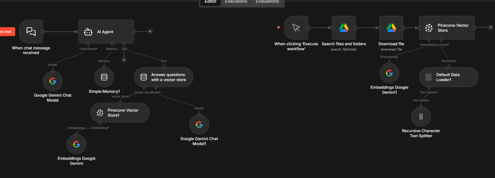

# n8n Workflows

This repository contains exported **n8n workflows** in JSON format. Each workflow can be imported into your n8n instance to use or customize.

## How to Use

1. **Import a Workflow**
   - Open n8n.
   - Click **+ New Workflow** → **Import** → select the JSON file from this repo.

2. **Update Workflows**
   - Edit your workflow in n8n.
   - Export it as JSON.
   - Replace the old JSON file in this repository.
   - Commit and push the changes to GitHub.

3. **Folder Structure**
   - `workflows/` – contains all workflow JSON files.
   - `README.md` – this file.

## Notes

- Each workflow is a standalone JSON file compatible with n8n version X.X.X.
- Make sure to check credentials or environment variables after importing a workflow.
- For best practice, name JSON files descriptively (e.g., `candidate_search_workflow.json`).

## License

This repository is for personal or organizational use. You can modify and share workflows freely.

# RAG based Personal assistant

This workflow handles searching candidate info using a vector store in n8n.

